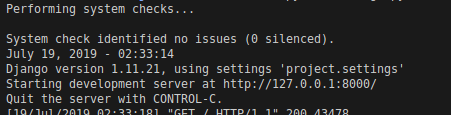
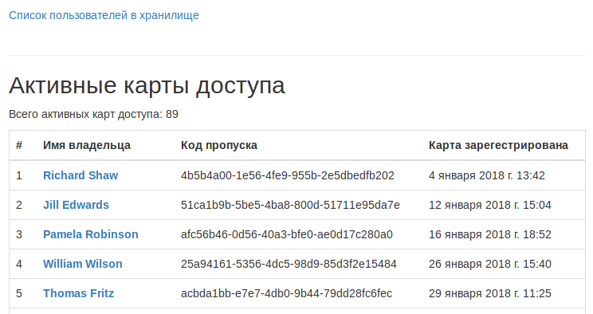

#Пульт охраны банка

_Это внутренний репозиторий для сотрудников банка «Сияние». Если вы попали в этот репозиторий случайно, то вы не сможете его запустить, т.к. у вас нет доступа к БД, но можете свободно использовать код вёрстки или посмотреть как реализованы запросы к БД._

Пульт охраны — это сайт, который можно подключить к удалённой базе данных с визитами и карточками пропуска сотрудников нашего банка.

###Цель проекта

Код написан в образовательных целях на онлайн-курсе для веб-разработчиков [dvmn.org](https://dvmn.org/modules/django-orm).

###Требование к окружению
Python3 должен быть уже установлен.

###Как установить

1. Запросите доступ к БД у менеджера вашего банка. Для доступа вам понадобятся адрес СУБД (`DB_HOST`), номер порта (`DB_PORT`), имя БД (`DB_NAME`), имя пользователя БД (`DB_USER`) и пароль (`DB_PASSWORD`), SECRET_KEY сайта (`TEST_KEY`).
   ...... [TODO: как эти данные выглядят]

2. В корневой папке проекта создайте файл .env и поместите в него полученные данные.

```
Содержимое файла .env
---------------------
    DB_HOST = '127.0.0.1'
    DB_PORT = '3300'
    DB_NAME = 'testDB'
    DB_USER = 'testUser'
    DB_PASSWORD = 'testPass'
    TEST_KEY = 'testSecretKey'
    DEBUG = False
```

3. Затем используйте `pip` (или `pip3`, если есть конфликт с Python2) для установки зависимостей:

```
pip install -r requirements.txt
```

Для запуска сайта на локальном сервере (localhost) используйте `python manage.py runserver` (или `python3 manage.py runserver`, если есть конфликт с Python2):

```
python manage.py runserver 127.0.0.1:8000.
```

###Выходные данные
В случае удачного выполнения команды в терминале результат будет следующим.

Доступ к сайту осуществляется по ссылке [http://localhost:8000](http://127.0.0.1:8000). В случае удачного запуска сайта результат будет выглядеть следующим образом.


